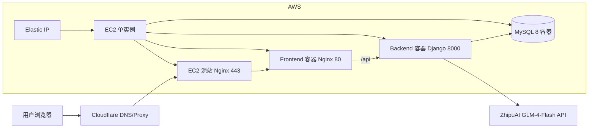

# 上云部署与域名连通说明（教师展示版）

## 1. 项目目标
本项目为智能在线考试系统，完成了从本地开发到云端可访问系统的完整落地，包含：
- 云服务器部署（AWS）
- 域名接入与解析（Namecheap + Cloudflare）
- HTTPS 安全访问（Let’s Encrypt）
- 前后端与数据库容器化运行（Docker Compose）
- AI 出题能力接入（智谱 GLM-4-Flash）

当前对外可访问网站：
- https://www.jlhuang-aiexam.me

---

## 2. 系统构造图（Architecture）

说明：
- Cloudflare 负责域名解析与边缘访问。
- AWS 采用单实例部署，绑定 Elastic IP，保证域名目标地址稳定。
- 源站 Nginx 负责 443 接入与反向代理。
- 前后端、数据库通过 Docker Compose 运行在同一台 EC2。

---

## 3. 上云资源与连通关系

### 3.1 云资源清单（当前运行态）
- 1 台 EC2（应用宿主机）
- 1 个 Elastic IP（固定公网 IP）
- 1 个安全组（开放 22/80/443/8000）
- 容器服务：frontend、backend、mysql

### 3.2 域名连通链路
1) 在注册商配置 NS 到 Cloudflare。  
2) 在 Cloudflare 配置记录：
- A 记录：@ 指向源站（通过 Cloudflare 代理）
- CNAME：www 指向 @
3) 用户访问域名后，流量路径为：
- 浏览器 -> Cloudflare -> 源站 443 -> 容器服务

---

## 4. 自动部署方式说明

本项目采用“基础设施自动化 + 应用容器自动化”两层方式。

### 4.1 基础设施自动化（IaC）
- 工具：Terraform
- 目录：infrastructure/terraform
- 作用：自动创建/销毁 AWS 资源（EC2、安全组、EIP 等）

常用脚本：
- learner-lab-deploy.ps1：一键部署（适配 Learner Lab）
- terraform apply / terraform destroy：可重复、可回滚

### 4.2 应用自动化部署
- 工具：Docker Compose（生产编排）
- 文件：docker-compose.prod.yml
- 前端：生产构建后以 Nginx 静态服务运行
- 后端：Django + Gunicorn
- 数据库：MySQL 8

部署行为：
- 更新代码后执行 compose build + up，即可完成应用重建与发布。

### 4.3 HTTPS 自动续期
- 证书来源：Let’s Encrypt
- 签发方式：Certbot
- 已启用自动续期任务（系统定时续期）

---

## 5. AI API 连通与配置

### 5.1 接入方式
后端通过 OpenAI Compatible 协议接入智谱大模型，关键环境变量：
- ZHIPUAI_API_KEY
- ZHIPUAI_MODEL（当前为 glm-4-flash）
- ZHIPUAI_BASE_URL（智谱开放平台地址）

### 5.2 生效验证
已通过线上接口调用验证 AI 能力可用：
- AI 出题接口返回 code=0
- 可返回结构化题目内容（题干、选项、答案等）

---

## 6. 网站当前可用性结果

### 6.1 功能连通
- 首页可访问
- 健康检查接口可访问
- 登录接口可访问
- AI 出题接口可访问

### 6.2 访问地址
- 主访问地址（建议）：https://www.jlhuang-aiexam.me

---

## 7. 关键优化与问题修复（实施过程摘要）

1) 从双实例高可用方案切换为单实例，降低成本。  
2) 增加 Elastic IP，解决实例重建后 IP 变化导致域名失效问题。  
3) 修复 Host Header 与 HTTPS 连通问题。  
4) 将前端改为生产模式静态部署，消除 HTTPS 下开发态 WebSocket 报错。  
5) 优化手机端适配：
- 搜索区自动换行
- 列表横向滚动
- 移动端抽屉菜单

---

## 8. 答辩可讲解要点（简版）

- 我们不是只“部署成功”，而是实现了完整链路：
  基础设施自动化 -> 容器化发布 -> 域名接入 -> HTTPS 安全访问 -> AI 功能连通。
- 系统具备可复现性：
  同一套 Terraform 与 Compose 配置可以重复部署、快速回滚。
- 方案具备教学价值：
  同时覆盖云计算、网络连通、安全证书、微服务编排与 AI 集成。

---

## 9. 后续可扩展方向

- 增加 CI/CD（GitHub Actions 自动构建与发布）
- 增加监控告警（容器健康、接口 SLA、证书过期提醒）
- 引入多环境分层（dev/staging/prod）
- 增加数据库备份与灾备演练

---

## 10. 结论
本项目已完成从“本地系统”到“云端可演示系统”的工程化闭环，实现了：
- 稳定的网站访问
- 可解释的网络连通路径
- 自动化部署与可回滚
- AI 能力在线可用

具备答辩展示和后续持续迭代的基础条件。
